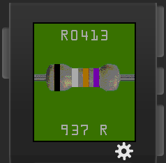

# resistor-time
Resistor color watchface for Pebble Time

This shows the current time as a resistor with the color code matching the time of day in 24-hour time.

This only works on the Basalt color platform, as there's no point trying to show color codes on a black and white watch.

Licensed under the MIT License, see LICENSE for details.

