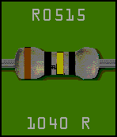
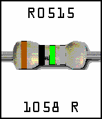
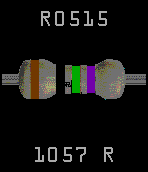
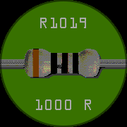
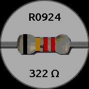
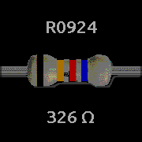

# resistor-time
Resistor color watchface for Pebble Time

This shows the current time as a resistor with the color code matching the time of day in 24-hour time.

This only works on the Basalt and Chalk color platforms, as there's no point trying to show
resistor color codes on a black and white watch.

* Version 1.4 switches to SDK 4, uses Clay for the configuration page (no more server!), supports
  custom colors, Bluetooth disconnection vibration, and changing display during quick view
* Version 1.3 adds support for Pebble Time Round watches.
* Version 1.2 fixes a problem where the app config screen defaulted to green instead of your last selection.
* Version 1.1 adds an app config screen on the phone to switch between green, black, and white background colors.

Licensed under the MIT License, see LICENSE for details.

 &nbsp;
 &nbsp;

 &nbsp;
 &nbsp;

