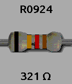

# resistor-time
Resistor color watchface for Pebble Time

This shows the current time as a resistor with the color code matching the time of day in 24-hour time.

This only works on the Basalt and Chalk color platforms, as there's no point trying to show
resistor color codes on a black and white watch.

* Version 2.2 is the first one published in the Rebble app store.  It adds surface mount resistors,
  NYC Resistors, and beats time display.
* Version 1.5 fixed a bug with four digit times not displaying.  UTF-8 takes up more buffer space, sadly.
* Version 1.4 switches to SDK 4, uses Clay for the configuration page (no more server!), supports
  custom colors, Bluetooth disconnection vibration, and changing display during quick view.  It also
  switches the font to Ubuntu Mono so we can show the ohm symbol.
* Version 1.3 adds support for Pebble Time Round watches.
* Version 1.2 fixes a problem where the app config screen defaulted to green instead of your last selection.
* Version 1.1 adds an app config screen on the phone to switch between green, black, and white background colors.

Licensed under the MIT License, see LICENSE for details.

[Available on the Rebble App Store](https://store-beta.rebble.io/#/app/55561ff444dad6e1470000df)

 &nbsp;
 &nbsp;

 &nbsp;
 &nbsp;

