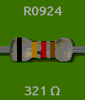
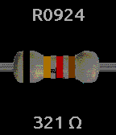

# resistor-time
Resistor color watchface for Pebble Time

[

This shows the current time as a resistor with the color code matching the time of day in 24-hour time.

This only works on the Basalt color platform, as there's no point trying to show color codes on a black and white watch.

Version 1.1 adds an app config screen on the phone to switch between green, black, and white background colors.

Licensed under the MIT License, see LICENSE for details.

